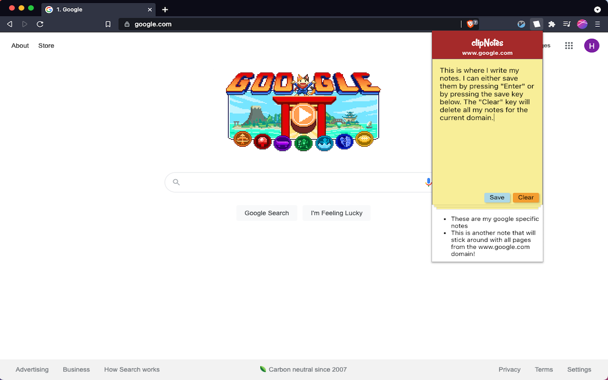
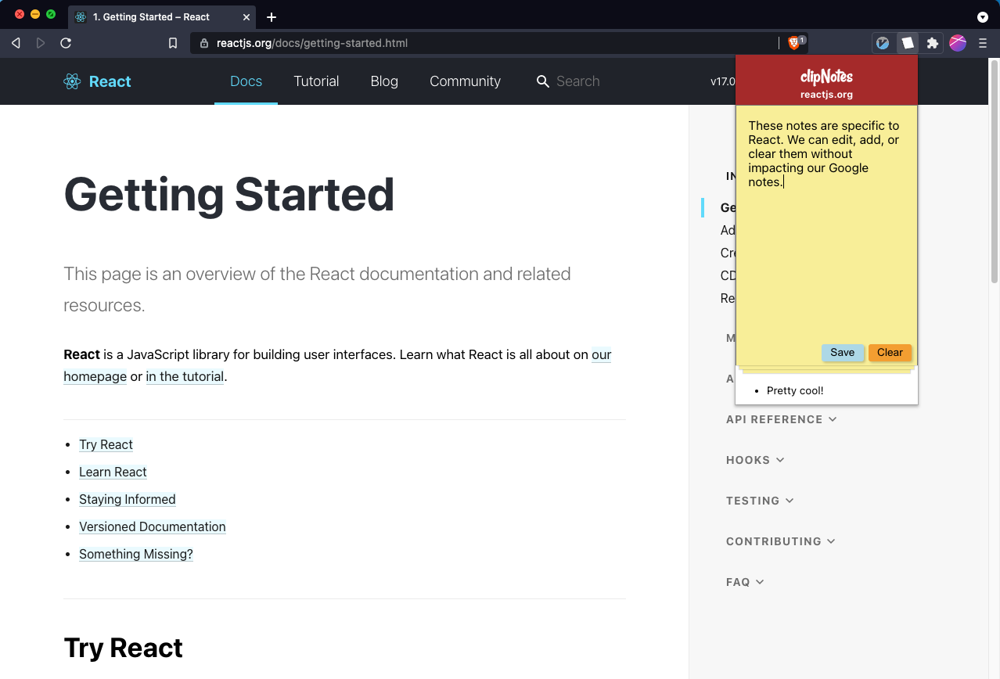

# 📝 ClipNotes

This is the repository for the clipNotes chrome extension. The application allows you to take persistent, domain-specific notes (for any website) inside of your browser.

The notes are persistent, and will stick around if you close your browser. This application was originally designed for developers who often take notes on specific technologies around the web, and want to be able to "link" their notes directly to the technology they are researching, making it easy to reference those notes in the future.

You can install clipNotes in the chrome extensions store.




## For Developers

Fork and clone the repository. Then run:

```
npm install
npm run start
```

This project is based on the Create React App template, and will create a `dev` folder when the development server is running that will automatically update the extension with your changes.

To open the extension in your browser, unpack the `dev` folder, like you would with any other extension folder.

## About the authors

The application won first place in Codesmith's "hackathon." It was designed and built by myself and <a href="https://github.com/AlexZayas">@AlexZayas</a> during the junior portion of the program.
